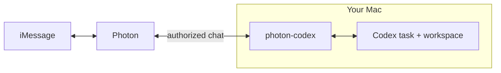

# photon-codex

[](https://nodejs.org/)
[](LICENSE)

Chat with your Codex from iMessage.

Send a task, image, document, or voice note. Codex works in your chosen workspace on your Mac and answers in the same conversation with text, files, or emoji reactions.

Follow up while it works. Reply to questions and approve commands or file changes from Messages. After a restart, the bridge resumes the task with your normal Codex configuration and permissions.



`photon-codex` accepts one sender in one direct conversation. It is one Node.js process. There is no public webhook, model API key, database, framework, or separate queue service.

## Install

You need:

- Node.js 20 or newer
- An authenticated local [Codex CLI](https://learn.chatgpt.com/docs/codex/cli)
- A Photon Spectrum project connected to [iMessage](https://photon.codes/platform/imessage)
- A phone number in E.164 format (`+...`) that you control or have explicit consent to use

Then:

```sh
git clone https://github.com/1Pio/photon-codex.git
cd photon-codex
npm install
npm link

photon-codex init
photon-codex auth set
photon-codex doctor
photon-codex service install
```

The optional bundled skill teaches Codex the iMessage rhythm and transport commands:

```sh
mkdir -p ~/.agents/skills
ln -s "$PWD/.agents/skills/photon-codex" ~/.agents/skills/photon-codex
```

Codex discovers the skill automatically. Restart Codex only if it does not appear.

`auth set` stores the Photon secret in macOS Keychain. The first accepted message locks the bridge to that sender and direct chat. Send it before Codex tries to send a message or file.

On macOS, `service install` adds a per-user LaunchAgent that restarts the bridge after a crash. On Linux or Windows, set `PHOTON_PROJECT_SECRET` and use your normal process supervisor.

## Use

You just send an iMessage. Codex uses the commands below when it needs to operate the bridge. You can run them too.

| Task | Command |
| --- | --- |
| Check the bridge | `photon-codex status` |
| Send a message | `photon-codex send "Hello"` |
| Send ordered bubbles | `photon-codex send-stack "Found it" "Here is the fix"` |
| Send visible progress | `photon-codex progress "Checking the live service"` |
| Edit an outbound message | `photon-codex edit MESSAGE_ID "Updated text"` |
| Send a document | `photon-codex send-file "/path/to/document.pdf" application/pdf` |
| Reply to a message | `photon-codex reply MESSAGE_ID "Got it"` |
| Add a reaction | `photon-codex react MESSAGE_ID 👍` |
| Start a fresh task | `photon-codex thread new` |
| Change workspace | `photon-codex workspace set /path/to/workspace` |
| Restart the service | `photon-codex service restart` |

Every control command returns JSON. Run `photon-codex logs 50` to read recent events.

`progress` creates one plain-text status for the active turn. `edit` can update any outbound text message still inside Apple's edit window. Apple currently permits five edits within 15 minutes; photon-codex caps progress updates at four and reserves one edit for a short plain-text final. Rich, long, file-bearing, expired, or failed edits fall back to the normal final delivery path. No progress state survives a restart.

`send-stack` accepts two to sixteen positional arguments and sends them in order. Its JSON result lists one receipt per bubble. A partial result stops at the first failure and reports `firstUnsentIndex`; retry only the unsent suffix. Multiple iMessage sends are not atomic.

`react` accepts `❤️`, `👍`, `👎`, `😂`, `‼️`, and `❓`, along with the aliases `love`, `like`, `dislike`, `laugh`, `emphasize`, and `question`. Any other single emoji uses a custom reaction.

## Configuration

`photon-codex init` creates `~/.config/photon-codex/config.json`:

```json
{
  "projectId": "<Photon project ID>",
  "allowedSender": "<E.164 number you control>",
  "cwd": "/path/to/workspace",
  "maxAttachmentBytes": 52428800,
  "codexOverrides": {
    "reasoningEffort": "medium",
    "fastMode": true,
    "followUpMode": "steer"
  }
}
```

| Override | Accepted values |
| --- | --- |
| `reasoningEffort` | `light`, `medium`, `high`, `extra high`, `max` |
| `fastMode` | `true`, `false` |
| `followUpMode` | `steer`, `queue` |

Leave an override out to use your normal Codex setting. photon-codex does not override anything else.

Restart the service after changing the file. Set `PHOTON_CODEX_HOME` if you want the runtime files somewhere other than `~/.config/photon-codex/`.

## Approvals and privacy

- Approval messages show the complete request. They may contain commands, working directories, network targets, permissions, paths, and file diffs.
- Secret input and approval requests that cannot be shown safely fail closed.
- Photon processes iMessage content. OpenAI processes the Codex task under each service's terms.
- Logs and `lastError` contain no message content. Config, state, attachments, chats, `doctor`, and `status` may contain private data. Review them before sharing.
- Use only a number you control or whose owner has explicitly consented. Do not send unsolicited messages.

Sent means Photon accepted the message, not that the recipient saw it.

## Development

Run `npm test` for the unit tests. Run `npm run test:live` to test against your authenticated Codex app-server.

Protocol references: [Codex app-server](https://learn.chatgpt.com/docs/app-server), [Spectrum edits, reactions, and replies](https://photon.codes/docs/spectrum-ts/reactions-and-replies), and [Apple's iMessage edit limits](https://support.apple.com/en-ae/guide/iphone/iphe67195653/ios).

MIT licensed. photon-codex is independent and is not affiliated with Photon, OpenAI, or Apple. Their names and marks belong to their owners.

Report vulnerabilities through [GitHub private vulnerability reporting](https://github.com/1Pio/photon-codex/security/advisories/new). That channel does not promise support or a response.
