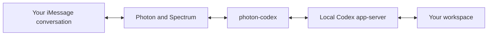

# photon-codex

[](https://nodejs.org/)
[](LICENSE)

`photon-codex` connects one authorized Photon iMessage conversation to one persistent local Codex task.

It is one small Node.js process. Photon and Spectrum carry messages. The authenticated local `codex app-server` runs Codex. There is no public webhook, model API key, database, framework, or separate queue service.



## What it does

- Accepts text, images, documents, voice messages, replies, and reactions from one exact sender in one direct conversation
- Resumes one persistent Codex task with native Codex configuration and permissions
- Optionally overrides only reasoning effort, fast mode, and follow-up mode
- Carries Codex approvals and questions over iMessage without shortening approval scope
- Sends threaded answers, exact-byte documents, and native or custom emoji reactions
- Persists a bounded follow-up queue, deduplication state, and content-free operational events
- Runs as a small restart-on-failure macOS LaunchAgent

## Requirements

- Node.js 20 or newer
- An authenticated local [Codex CLI](https://learn.chatgpt.com/docs/codex/cli)
- A Photon Spectrum project with iMessage connected
- An E.164 number you control, or a recipient who has explicitly consented

## Install

```sh
git clone https://github.com/1Pio/photon-codex.git
cd photon-codex
npm install
npm link

photon-codex init
photon-codex auth set
photon-codex doctor
photon-codex service install
```

`auth set` stores the Photon secret in macOS Keychain. The recommended macOS runtime is the per-user LaunchAgent installed by `service install`. On Linux or Windows, set `PHOTON_PROJECT_SECRET` and run the bridge with your normal process supervisor.

The first accepted inbound message binds the configured sender to that exact direct conversation. This inbound-first handshake is required before agent-initiated sends.

## Configuration

Runtime files live in `~/.config/photon-codex/`. Set `PHOTON_CODEX_HOME` to move the complete directory.

`photon-codex init` writes a private `config.json` with this shape:

```json
{
  "projectId": "<Photon project ID>",
  "allowedSender": "<E.164 number you control>",
  "cwd": "/path/to/workspace",
  "maxAttachmentBytes": 52428800,
  "codexOverrides": {
    "reasoningEffort": "medium",
    "fastMode": true,
    "followUpMode": "steer"
  }
}
```

`codexOverrides` and each field inside it are optional. Omitted values inherit native Codex configuration unchanged.

| Field | Accepted values | Effect |
| --- | --- | --- |
| `reasoningEffort` | `light`, `medium`, `high`, `extra high`, `max` | Maps to Codex-native `low`, `medium`, `high`, `xhigh`, `max` |
| `fastMode` | `true`, `false` | Selects priority or default service tier |
| `followUpMode` | `steer`, `queue` | Steers the active turn or queues follow-ups in order |

No other Codex setting can be overridden here. Codex still resolves the normal `$CODEX_HOME/config.toml` and trusted project configuration for the selected workspace. The bridge verifies effective values on new tasks, resumes, restarts, and later turns. Restart the service after changing configuration.

## Use

```sh
photon-codex status
photon-codex logs 50
photon-codex send "Hello"
photon-codex send-file "/path/to/document.pdf" application/pdf
photon-codex reply MESSAGE_ID "Got it"
photon-codex react MESSAGE_ID 👍
photon-codex thread new
photon-codex workspace set /path/to/workspace
photon-codex service restart
```

All control commands return JSON. `send-file` reads and bounds the file in the calling process, then sends an authenticated size-and-hash-checked byte snapshot to the bridge. The service never opens the caller's path. A successful receipt proves that Photon accepted the write, not that the recipient viewed it.

Classic Tapbacks use `❤️`, `👍`, `👎`, `😂`, `‼️`, or `❓`. The aliases `love`, `like`, `dislike`, `laugh`, `emphasize`, and `question` are also accepted. Other single emoji graphemes use custom iMessage reactions.

## Approvals and privacy

The bridge inherits Codex approval policy, reviewer, sandbox, network policy, rules, tools, skills, plugins, and apps. It does not weaken an unsupported prompt. Secret-input requests, approvals without an exact scope, and forms it cannot fully validate fail closed.

Approval messages intentionally preserve the complete scope. They can include exact commands, working directories, network targets, permission scopes, file paths, and file diffs. Those values, and the iMessage conversation itself, may contain sensitive information. Photon processes message content, and OpenAI processes the Codex task according to their respective services and terms.

`doctor` and `status` are intentionally detailed. Their output can contain private paths, account and configuration details, task identifiers, service process data, and operational state. Review it manually before sharing it anywhere.

The operational `runtime.log` contains only allowlisted event names, booleans, counts, categories, and stable error codes. It never persists message bodies, phone numbers, credentials, identifiers, paths, commands, diffs, or arbitrary exception strings. `lastError` uses the same content-free boundary. `config.json`, `state.json`, received attachments, approval iMessages, `doctor`, and `status` remain private operational data.

The CLI control socket listens only on loopback. It requires a bounded token preface before accepting a framed body, limits body size and concurrent connections, and times out stalled receive phases. This protects the bridge protocol from unauthenticated or accidental local input. It is not a security boundary against compromise of the same operating-system account.

Use photon-codex only with a number you control or with the recipient's explicit consent. Do not use it for unsolicited messaging. You are responsible for applicable messaging, privacy, carrier, Photon, OpenAI, and Apple requirements.

## Runtime boundaries

- Photon credentials are excluded from the Codex child environment. The project secret is never written to config or the service definition.
- Inbound files use private permissions, sanitized names, and a 50 MiB default limit.
- The accepted/replied/ignored ID sets and follow-up queue are bounded and persisted across restarts.
- Provider receipts and delivery events are not treated as recipient observation.
- Desktop-only UI, screen context, host-owned macOS permissions, and other injected client capabilities are outside configuration parity.

## Development

```sh
npm test
npm run test:live
npm run doctor
```

The live suite uses the installed authenticated Codex app-server, verifies native inheritance and every supported override combination, resumes the same persistent test task after restart, performs a real turn, and archives its temporary task.

The implementation follows the [Codex app-server protocol](https://learn.chatgpt.com/docs/app-server), [Spectrum reactions and replies](https://photon.codes/docs/spectrum-ts/reactions-and-replies), and the Spectrum iMessage attachment contract.

## Security, license, and trademarks

Report vulnerabilities through GitHub private vulnerability reporting as described in [SECURITY.md](SECURITY.md). This project provides no support or response commitment.

MIT licensed. See [LICENSE](LICENSE).

This is an independent project. It is not affiliated with, endorsed by, or sponsored by Photon, OpenAI, or Apple. Photon, Spectrum, Codex, OpenAI, iMessage, Apple, and other marks belong to their respective owners. No third-party logos are used.
