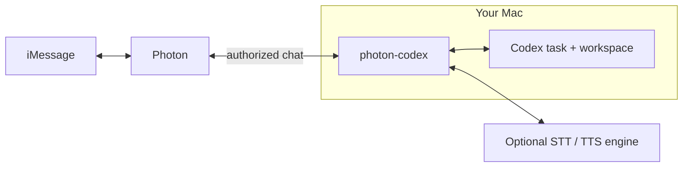

# photon-codex

[](https://nodejs.org/)
[](LICENSE)

Chat with your Codex over iMessage.

Send a task, image, document, or voice note. Codex works in your chosen workspace on your Mac and answers in the same conversation with text, voice notes, files, or emoji reactions.

Follow up while it works. Reply to questions and approve commands or file changes from Messages. After a restart, the bridge resumes the task with your normal Codex configuration and permissions.



`photon-codex` accepts one sender in one direct conversation. It is one Node.js process. There is no public webhook, OpenAI API key, database, framework, or separate queue service.

## Install

You need:

- Node.js 20 or newer
- An authenticated local [Codex CLI](https://learn.chatgpt.com/docs/codex/cli)
- A Photon Spectrum project connected to [iMessage](https://photon.codes/platform/imessage)
- Your personal phone number in E.164 format (`+...`)
- Optional: an ElevenLabs API key with access to STT, TTS, or both

Then:

```sh
git clone https://github.com/1Pio/photon-codex.git
cd photon-codex
npm install
npm link

photon-codex init
photon-codex auth set
photon-codex doctor
photon-codex service install
```

The optional bundled skill teaches Codex the iMessage rhythm and transport commands:

```sh
mkdir -p ~/.agents/skills
ln -s "$PWD/.agents/skills/photon-codex" ~/.agents/skills/photon-codex
```

Codex discovers the skill automatically. Restart Codex only if it does not appear.

`auth set` stores the Photon secret in macOS Keychain. The first accepted message locks the bridge to that sender and direct chat. Send it before Codex tries to send a message or file.

Voice is optional. To transcribe incoming voice notes and use ElevenLabs speech, add a narrowly scoped ElevenLabs API key:

```sh
photon-codex auth set elevenlabs
photon-codex service restart
```

The key also stays in macOS Keychain. Text, files, reactions, approvals, and MSD speech keep working without it. On Linux or Windows, set `ELEVENLABS_API_KEY` in the bridge process instead.

On macOS, `service install` adds a per-user LaunchAgent that restarts the bridge after a crash. On Linux or Windows, set `PHOTON_PROJECT_SECRET` and use your normal process supervisor.

## Use

You just send an iMessage. Codex uses the commands below when it needs to operate the bridge. You can run them too.

| Task | Command |
| --- | --- |
| Check the bridge | `photon-codex status` |
| Send a message | `photon-codex send "Hello"` |
| Send ordered bubbles | `photon-codex send-stack "Found it" "Here is the fix"` |
| Send a voice note | `photon-codex send-voice "[laughs] That fixed it"` |
| Direct MSD delivery | `photon-codex send-voice --instruct "warm, concise" "That fixed it"` |
| Send visible progress | `photon-codex progress "Checking the live service"` |
| Edit an outbound message | `photon-codex edit MESSAGE_ID "Updated text"` |
| Send a document | `photon-codex send-file "/path/to/document.pdf" application/pdf` |
| Reply to a message | `photon-codex reply MESSAGE_ID "Got it"` |
| Add a reaction | `photon-codex react MESSAGE_ID 👍` |
| React to the active request | `photon-codex react current 👍` |
| Start a fresh task | `photon-codex thread new` |
| Change workspace | `photon-codex workspace set /path/to/workspace` |
| Restart the service | `photon-codex service restart` |

Every delivery command returns JSON. With the default manual final-delivery mode, its receipt also reminds Codex that every visible part must be sent through the CLI. Run `photon-codex logs 50` to read recent events.

`progress` creates one plain-text status for the active turn. `edit` can update any outbound text message still inside Apple's edit window. Apple currently permits five edits within 15 minutes. After four progress edits, photon-codex warns that only the completion edit should remain. In automatic mode, that fifth edit is reserved for a short plain-text final. No progress state survives a restart.

`send-stack` accepts two to sixteen positional arguments and sends them in order. Its JSON result lists one receipt per bubble. A partial result stops at the first failure and reports `firstUnsentIndex`; retry only the unsent suffix. Multiple iMessage sends are not atomic.

Incoming iMessage voice notes are transcribed with Scribe v2 and clearly labeled for Codex as possibly imperfect. Names, technical terms, and noisy speech deserve extra care. The bridge does not retain the source audio. The transcript becomes normal Codex conversation content and can also enter the durable follow-up queue.

`send-voice` creates one native iMessage audio message and counts as the delivered answer for the active turn. Eleven v3 is the expressive default and supports intentional audio tags such as `[laughs]`, `[whispers]`, and `[curious]`. Eleven Flash v2.5 favors lower latency. With `msd`, `--instruct` controls delivery while MSD keeps ownership of its model configuration. Exact links, commands, and filenames belong in text bubbles, not spoken audio.

`react` accepts `❤️`, `👍`, `👎`, `😂`, `‼️`, and `❓`, along with the aliases `love`, `like`, `dislike`, `laugh`, `emphasize`, and `question`. Any other single emoji uses a custom reaction.

## Configuration

`photon-codex init` creates `~/.config/photon-codex/config.json`:

```json
{
  "projectId": "<Photon project ID>",
  "allowedSender": "<E.164 number you control>",
  "cwd": "/path/to/workspace",
  "maxAttachmentBytes": 52428800,
  "autoSendFinal": false,
  "codexOverrides": {
    "reasoningEffort": "medium",
    "fastMode": true,
    "followUpMode": "steer"
  },
  "voice": {
    "ttsEngine": "elevenlabs",
    "elevenlabs": {
      "sttModel": "scribe_v2",
      "ttsModel": "Eleven v3",
      "voiceId": "FSZ4QLofSALZxepAyq63",
      "stability": 0.5,
      "similarityBoost": 0.75,
      "speed": 1
    },
    "msd": {
      "voice": null
    }
  }
}
```

`autoSendFinal` is `false` by default. In this mode, normal Codex final messages, commentary, reasoning summaries, tool calls, tool output, and reaction directives are never interpreted as iMessage output. Codex must use `send`, `send-stack`, `send-voice`, `edit`, `reply`, `react`, or `send-file` for every user-visible result. Approvals and failure notices continue to work normally.

Set `autoSendFinal` to `true` to deliver the normal Codex final answer automatically. That mode also enables automatic progress-to-final editing when the result is short plain text and remains inside Apple's edit window. Long, rich, file-bearing, expired, or failed edits use the normal reliable final path.

| Override | Accepted values |
| --- | --- |
| `reasoningEffort` | `light`, `medium`, `high`, `extra high`, `max` |
| `fastMode` | `true`, `false` |
| `followUpMode` | `steer`, `queue` |

Leave an override out to use your normal Codex setting. photon-codex does not override anything else. `autoSendFinal` is a bridge setting, not a Codex override.

`voice.ttsEngine` accepts `elevenlabs` or `msd`. `voice.elevenlabs.ttsModel` accepts `Eleven v3` or `Eleven Flash v2.5`. Stability ranges from `0` to `1`; Flash also uses similarity from `0` to `1` and speed from `0.7` to `1.2`. Eleven v3 controls pace and expression through text and audio tags instead. `voice.msd.voice` is optional, and photon-codex never overrides MSD's model. macOS uses its built-in audio converter. Other platforms need `ffmpeg` on `PATH`.

Restart the service after changing the file. Set `PHOTON_CODEX_HOME` if you want the runtime files somewhere other than `~/.config/photon-codex/`.

## Approvals and privacy

- Approval messages show the complete request. They may contain commands, working directories, network targets, permissions, paths, and file diffs.
- Secret input and approval requests that cannot be shown safely fail closed.
- Photon processes iMessage content. OpenAI processes the Codex task under each service's terms.
- ElevenLabs receives incoming voice audio and text passed to ElevenLabs `send-voice`. MSD speech remains local. Review each provider's privacy and retention terms for your account.
- Logs and `lastError` contain no message content. Config, state, attachments, chats, `doctor`, and `status` may contain private data. Review them before sharing.
- Use only a number you control or whose owner has explicitly consented. Do not send unsolicited messages.

Sent means Photon accepted the message, not that the recipient saw it.

## Development

Run `npm test` for the unit tests. Run `npm run test:live` to test against your authenticated Codex app-server.

Protocol references: [Codex app-server](https://learn.chatgpt.com/docs/app-server), [Spectrum edits, reactions, and replies](https://photon.codes/docs/spectrum-ts/reactions-and-replies), [Spectrum voice messages](https://photon.codes/docs/spectrum-ts/content/voice), [ElevenLabs speech to text](https://elevenlabs.io/docs/api-reference/speech-to-text/convert), [ElevenLabs text to speech](https://elevenlabs.io/docs/api-reference/text-to-speech/convert), and [Apple's iMessage edit limits](https://support.apple.com/en-ae/guide/iphone/iphe67195653/ios).

MIT licensed. photon-codex is independent and is not affiliated with Photon, OpenAI, Apple, or ElevenLabs. Their names and marks belong to their owners.

Report vulnerabilities through [GitHub private vulnerability reporting](https://github.com/1Pio/photon-codex/security/advisories/new). That channel does not promise support or a response.
